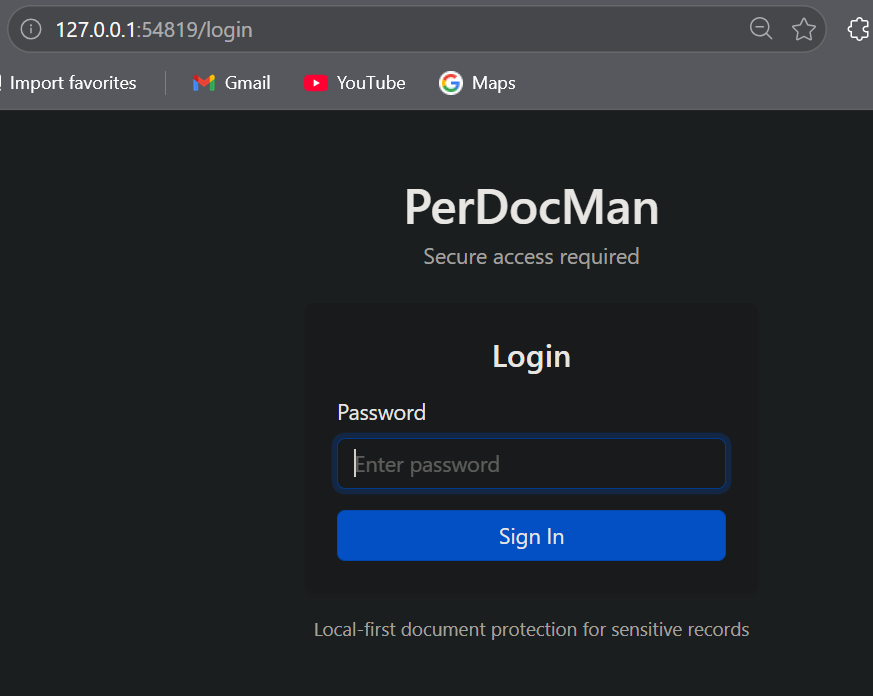
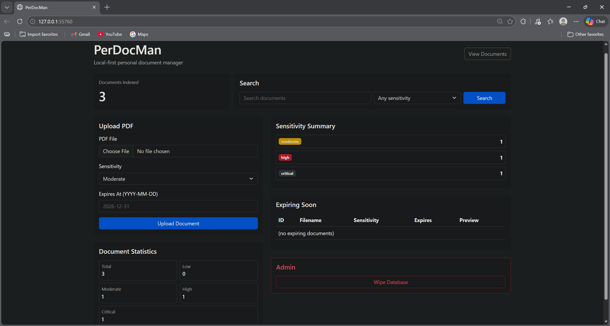
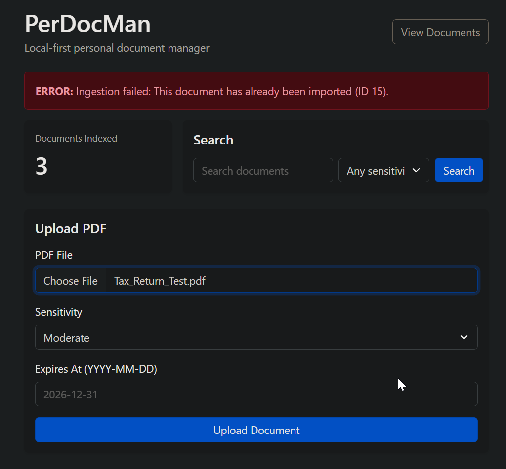
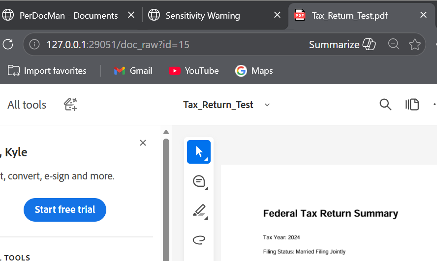
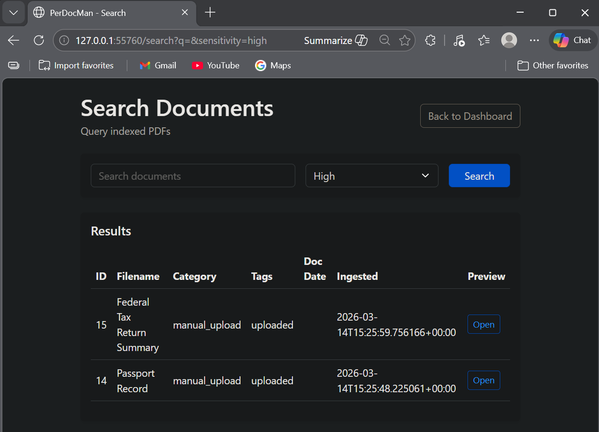
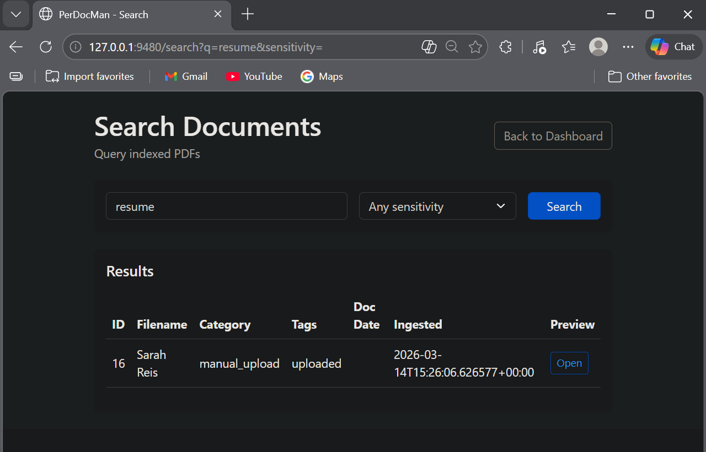
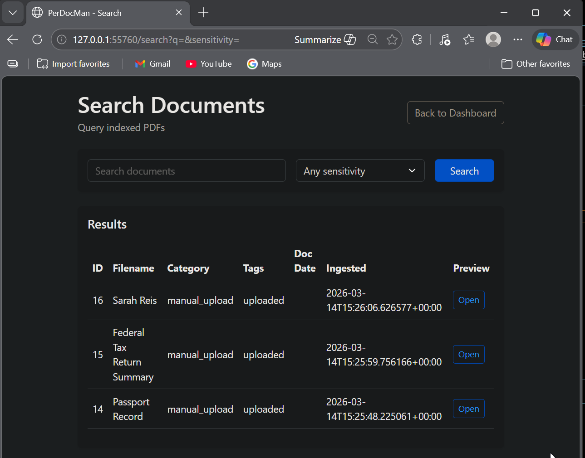
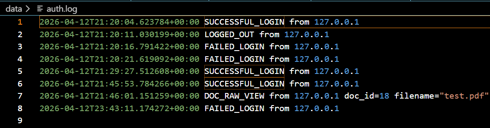
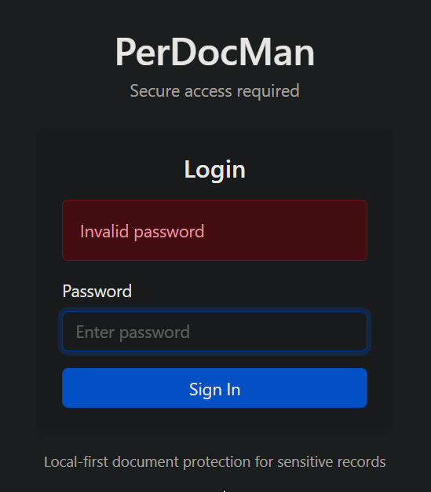

# PerDocMan (Personal Document Manager)

PerDocMan is a **local-first document management system** built in Python using SQLite. It ingests PDF documents, stores metadata, and provides retrieval, search, and preview functionality — all without relying on cloud services.

This project was developed as a senior seminar capstone focused on **privacy-preserving document indexing, data integrity, and secure local access control**.

---

## Features

### Core Functionality

- PDF ingestion via web interface  
- Local storage of documents in a managed directory  
- Metadata persistence using SQLite  
- SHA-256 hashing for duplicate detection  
- Automatic duplicate prevention  
- Document listing and dashboard view  
- Keyword-based search across metadata and preview text  
- Inline PDF preview in browser  

---

### Security and Access Control

- Password-based authentication system  
- Secure password hashing using PBKDF2 with salt  
- Session-based authentication using secure tokens  
- Session expiration enforcement (30-minute timeout)  
- Protected routes requiring authentication  
- Logout functionality with session invalidation  
- Audit logging of authentication and document access events (`auth.log`)  
- Sensitivity-based document classification (low, moderate, high, critical)  
- Warning workflow for high/critical document access  

---

### Data Integrity

- SHA-256 hashing to uniquely identify documents  
- Duplicate file detection before ingestion  
- Controlled ingestion pipeline (temp → validate → store → commit)  
- SQLite database as source of truth  
- File-system validation during document access  
- Safe database reset (logical wipe without schema loss)  

---

### Administrative Controls

- Logical database wipe (documents + sessions cleared)  
- Confirmation prompt for destructive operations  
- Graceful recovery after reset  

---

## Screenshots

### Login Interface

### Dashboard

### Duplicate Detection

### Document Preview

### Search (High Sensitivity)

### Search (Keyword)

### Search (All Results)

### Authentication Logging

### Authentication Failure

---

## System Architecture

- **Language:** Python 3.11+  
- **Web Server:** BaseHTTPRequestHandler  
- **Database:** SQLite (local file-based)  
- **Storage:** Local filesystem (`data/documents/`)  
- **Hashing:** SHA-256  
- **PDF Parsing:** pypdf  

All operations are performed locally. No external APIs or cloud services are used.

---

## Project Structure
src/
├── launcher.py
├── perdocman_server.py
├── db.py
├── ingest.py
├── reset_db.py
└── config.py

data/
├── documents.db
├── documents/
└── auth.log

docs/
├── architecture.md
├── search-design.md
├── security-model.md
├── security.md
├── data-integrity.md
├── testing-validation.md
├── version-history.md
└── images/

---

## Running the Application

Activate your virtual environment:
..venv\Scripts\activate

Run the application:
..venv\Scripts\python.exe -m src.launcher

### Automatic Launch Behavior

The launcher:

- Starts a local HTTP server bound to `127.0.0.1`
- Automatically selects an available port
- Opens the application in your default web browser

You will be directed to a URL similar to:
http://127.0.0.1:<PORT>/

No manual port configuration is required.

---

## Resetting the Database

Use the **Wipe Database** button on the dashboard.

This performs a logical reset:
- Deletes all document records  
- Deletes all session records  
- Removes stored PDF files  
- Preserves database schema  

---

## Current Limitations

- Authentication is suitable for a local prototype but not production-grade  
- No role-based access control (single-user assumption)  
- No encryption-at-rest for stored documents  
- Sessions are stored in memory (not persistent across restarts)  
- No HTTPS (local-only HTTP server)  
- No full-text or semantic search (keyword-based only)  
- No individual document deletion  

---

## Future Enhancements

- Encryption-at-rest for document storage  
- Role-based access control (RBAC)  
- Persistent session management  
- Embedding-based semantic search  
- Vector database integration  
- Document versioning and lifecycle management  
- REST API abstraction layer  

---

## Educational Objectives

This project demonstrates:

- Local-first secure system design  
- Authentication and session management  
- Audit logging and traceability  
- Data integrity through hashing and controlled ingestion  
- Defensive database schema design  
- Extensible architecture for future enhancements  

---

## License

Prototype — Educational Use Only